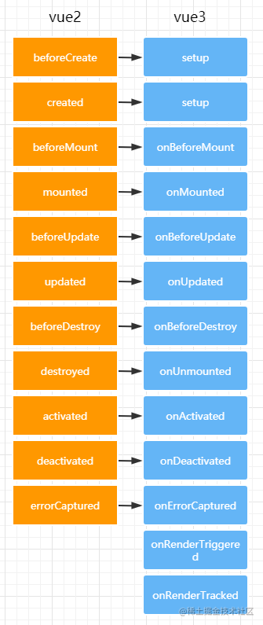

### vue3 中的 created 和 vue2 中的 created 有什么区别

根据生命周期对比，可以看到在 vue3 中 created 已完全被 setup 所替代，所以在 vue3 中是没有 created 的。这道题是在几天前被面试官问到的，所以在这里贴出来。

Tips：虽然 vue3 中没有 created，但是在 vue3 中仍可以用 created，只是用的是 vue2 中的 created,因为 vue3 向下兼容 vue2
